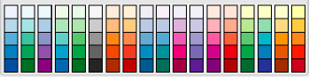
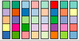

```{r setup, include=FALSE}
knitr::opts_chunk$set(echo = TRUE)
```

\newpage
# 1) Color Pallets

When using color in visualizations there are different kinds of pallets that can
be used.

## a. Pallet 1

Describe the pallet and explain when you would use such a pallet.

```{r echo=FALSE, fig.align='center'}

```

***

The palette above is an example of sequential color schemes using multi-hued
colors. 

Each scheme is sequential because it allows the highlighting of order in data
through the use of shading. Within a given hue such as blue, there are multiple
shades from light to dark. The lightness or darkness of the hue can be used to
represent different levels of values. Typically, light hues represent low
values and dark hues represent high values.

Each scheme is multi-hued meaning the colors used are not just shades of a
single hue but instead, use multiple hues. When using multiple hues, the
palettes still provide a pleasing aethetic transition from lighter shades to
darker shades that preserves the implied sequential meaning of the collective
colors.

Sequential colors schemes are suited to highlighted data that can be categorized
into ordered categories. Examples could be age ranges, levels of experience,
density ranges, etc.  

One vizualiation that may beneit from this color scheme, is a tile plot. One of the main features of a heat map, is its use of color to distinguish ordinal categorical variables, in a spacial setting.  With a sequential color scheme as such, I would apply this theme to a heat map, in order to provide a well read, distinguishable, vizualization.  

***

## b. Pallet 2

Describe the pallet and explain when you would use such a pallet.

```{r echo=FALSE, fig.align='center'}
knitr::include_graphics('1b.png')
```

***

The palette above is an example of diverging color schemes. Each scheme is
diverging because it allows the highlighting of both central and extreme values
in underlying data. Lighter shades and hues are used as the central colors in
each of these palettes. In the palettes above, each has five (5) colors with
the third (3) color being the central, lightest color. Moving away from this
color in either direction towards the first and last colors in the palette, the
shades and hues get darker. The colors diverge away from a light, neutral color
towards darker, more distinct colors. The colors at the ends of the palettes
typically contrast highly from each other to help amplify the meaning of the
divergence in the underlying data away from its central values.

Diverging colors schemes are suited to highlight the central and extreme value
in data distributions. The light coloring of central values tends to indicate
the typical values of data while the bold, contrasting coloring of extreme
values tends to highlight these extreme values. Examples could be grade
distributions, income level distributions, age ranges, etc.

Note that many datasets could be highlighted by either sequential or diverging
schemes. For example, age ranges could be highlighted by either. However, the
intent of the visualization would help dictate which to use. Consider a
question posed such as "Comparing pre-teen, teen, adult, and eldery
populations...?" Now consider a second, similar question posed such as "What are
the average ages...?" The first question is being posed from a categorial
perspective that implies a sequence tied to human lifecycles. There is implied
interest in order so a sequential color scheme would be applicable. For the
second question, there was not much emphasis on any difference between young or
old but instead more interest in the distribution, the *average*. In this case,
a diverging color scheme may be more suited to the vizualization to not only
highlight the average (central valeus) but also highlight the extremes.

***

## c. Pallet 3

Describe the pallet and explain when you would use such a pallet.

```{r echo=FALSE, fig.align='center'}

```

***

The palette above is an example of qualitative color schemes. Each scheme is
designed with a set of color shades and hues that contrast from one another.
Sequential and diverging color schemes do not try to contrast as much but
instead try to show more relationship or transitioning of values between each
color. Qualitative schemes try to show the contrast as much as possible
attempting to highlighted the grouping and differences more than the
similarities or nearness to other groups.

Qualitative color schemes are best used when tyring to depict different
categories of data that are more distinct from each other than they are as
similar or close to one another. Examples include demographic data such as
racial identity, gender identity, political affiliation, religious affiliation,
sports team fan affiliation, etc.

Some vizualization to which this color scheme could be applied, include pie charts, waffle plots, donut plots, and ring plots.  

***

\newpage
# 2) Earthquakes

```{r}
library(tidyverse)
library(ggmap)
```


Here is the link to the USGS website where the worldwide
[earthquake](https://earthquake.usgs.gov/earthquakes/feed/v1.0/) data can be
downloaded. Download all earthquake data for the past 30 days in .csv format.
Using R, make a map of the world with points where the earthquakes occurred.
Make a bubble map using the magnitude. Thoroughly discuss your visualizations.

## World Map of Points

  As the earthquake data of the past 30 days is updated every minute, it is important to specify that the earthquake data was downloaded at 1:08 p.m., on November 18, 2019.
  
  To begin the map, I will read in the earthquake dataset under the variable name: "earthquake."
```{r}
earthquake <- read_csv("earthquake.csv", col_names = TRUE)
head(earthquake)
```

Variable | Description
---------|-----------
time | Time of Earthquake occurence
latitude | Latitude Location of Earthquake
longitude | Longitude location of Earthquake
depth | Depth of the Event
mag | Magnitude of Event
magType | Algorithm or Method Used to Evaluate the Method of the Earthquake
nst | Number of Seismic Stations used to evaluate Eathquake Location
gap | The Largest azimutahl gap between azimuthally adjacent stations (in degrees)
horizontalError | Uncertainty of Observed Event's Location (in KM)
dmin | Smallest observed Distance to event epicenter from the Closest Seismic Station
rms | Root Mean Square Calculations of Residuals in predictions of Event occurence.
net | ID of Data Contributer
id | Unique Identification of Eathquake
updated | Time of Upload in Original Dataset
place | Nearby Named Geographical Region
horizontalError | Uncertainty of Earthquake Location (in KM)
depthError | Uncertainty of Earthquake Depth (in KM)
magNst | Total number of Seismic Stations used to Calculate Earthquake's Magnitude
Status | Indicates Whether Event has been viewed by a Person
locationSource | Network that Authored location of Event
magSource | Network that Authored Preffered Magnitude
-------------------


```{r}
ggplot(data = earthquake) +
  borders("world") + 
  geom_point(mapping = aes(x = longitude, y = latitude, color = mag))
```

**Analysis:** As evident from the world map, it appears that the west coast of the United States has had the highest amount of recorded earthquakes in the past 30 days.  Other frequent earthquakes sites include Japan, Malaysia, Alaska, and the Phillipines.  While the West coast of the United States appears to have the biggest cluster of earthquakes, the continent and shoreline of Asia appears to have the most earthquakes with the highest magnitude.  


## Bubble Map of Earthquakes by Magnitude (With Labels)

```{r}
radius <- sqrt(earthquake$mag/ pi )
symbols(earthquake$nst, earthquake$magNst, circles = radius, inches = .35, fg = "white", bg = "salmon", xlab = "NST", ylab = "MagNST", main = "Bubble Chart with Circle Radius by Magnitude")
text(earthquake$nst, earthquake$magNst, earthquake$place, cex = .5)
```
**Analysis:**  For the Bubble Chart, we decided to utilize the variables NST, MAgNST, and the Magnitude.  The x-axis represents the amount of seismic sensors used to detect the location, and the y-axis represents the number of seismic sensors used to calculate the magnitude.  The diameter of each circle, is based off of the Magnitude for each indivudal observation. 
  As evident from the bubble chart, it appeards that there are more Location seismic sensors used than sensors used to calculate magnitude.  In addition, one can tell from the distribuion of the larger circles, that the number of seismic sensors used has no effect on evaluating the magnitude of a quake.  
  
  As the clustering of the circle's labels leads to a very distracting plot, the bubble plot has been plotted again, without the text labels. 


## Bubble Plot of Earthquakes by Magnitude (Without Labels)

```{r}
symbols(earthquake$nst, earthquake$magNst, circles = radius, inches = .35, fg = "white", bg = "salmon", xlab = "NST", ylab = "MagNST", main = "Bubble Chart with Circle Radius by Magnitude")
```


***

TO DO

***

\newpage
# 3) Disease / Illness Story

See `Final.pdf` in this project's Files section for detailed instructions.

***

# API Overview

The R package `WHO`, provides a simple API to access the GHO. It only provides
two functions: `get_codes()` and `get_data()`. Inside the GHO, each time series
that exists is identifed by a label. Each label is a code that uniquely
identifies the series. These labels are then used a a parameter to `get_data()`
to retrieve the time series observations.

```{r}
#install.packages("WHO")
library(WHO)
```

The code below uses the `extra` parameter to download all metadata available for
the GHO codes.

```{r}
who_codes <- get_codes(extra = TRUE)
glimpse(who_codes)
```

There are `r formatC(length(who_codes$label), format = "d", big.mark = ",")`
indicators or time series in this dataset. The `category` variable is a WHO
grouping of the indicators into `r n_distinct(who_codes$category)` sets of
indicators as follows:

\tiny

```{r}
who_codes %>%
  group_by(category) %>%
  summarise(indicator_count = n()) %>%
  knitr::kable()
```

\normalsize

Note the following about the above categories.

1. There are 447 indicators that do not have a category assigned by the WHO.
   These should be considered as a category called `Uncategorized` or
   `No category`.
2. The naming convention is not consistent across categories. For example, some
   use single words, phrases, all capital letters, irregular case, etc. Category
   names should be somewhat standardized while retaining the original meaning in
   the dataset.
3. A number of categories appear to be fragmented. For example, there are
   three premutations of *Neglected Tropical Diseases* that need to be combined
   into a single category.

The table below provides a list of the indicators in the
*Demographic and socioeconomic statistics* category. However, inspection of the
table should make it apparent that a number of these indicators are based on
population.

```{r}
who_codes %>%
  filter(category == "Demographic and socioeconomic statistics") %>%
  select(label, display) %>%
  knitr::kable()
```

A closer look may make it apparent that the data may not have a total population
number. It is possible that `WHS10_1` could have it by the `display` string.

```{r}
who_codes %>%
  filter(label == "WHS10_1")
```

Inspection of the indicator observation in the metadata shows that the `url` and
`definition_xml` variables are URLs to further information about the indicator.
`url` is an address for a web page on the GHO registry that explains what the
indicator represents. The `defintion_xml` provides the same information
presented in the explanation page in XML format.

As the [explanation page](https://www.who.int/data/gho/indicator-metadata-registry/imr-details/3056)
suggests, the `WHS10_1` indicator does reflect the population count/census
statistic. This may or may not be useful when used with other indicators. In
looking at all indicators in the metadata, there are at least three others that
are called `Population`.

```{r}
who_codes %>%
  filter(str_detect(display, "^Population$")) %>%
  select(label, display, category)
```

## API Risks

Based on the analysis above, the following risks appear to exist when using this
API dataset.

1. The data is not tidy and needs to be made such before detailed analysis can
   be completed.
2. The structure of the data is inconsistent and needs detailed exploration when
   deciding on which indicators to use.
3. The `category` variable in the metadata (i.e. codes) is not very reliable.
   Careful considerations need to be made when leveraging this variable. The
   category should be used as the basis for a new variable which is a reliable
   identifier for logically-related indicators.

## API Rewards

Based on the analysis above the following benefits seem to be gained by using
this API and dataset.

1. The data can be accessed using the simple `WHO` package.
2. The data is acessible via the Internet via on-demand API calls.
3. The data contains international health and disease data along with related
   indicators.

# Usage Prototype

The sections below provide a prototypical usage for this dataset and API. The
actual use and visualization of the data will vary between projects. However,
the sections below demonstrate common usage patterns for this data and API.

## Prototype Assumptions / Requirements


***
